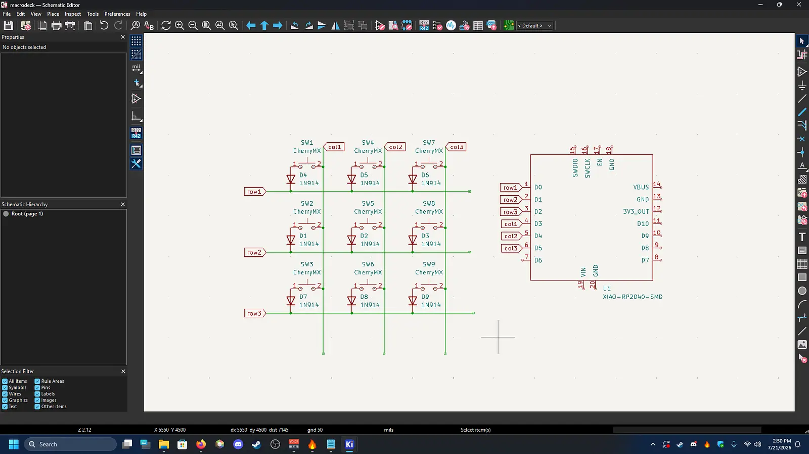
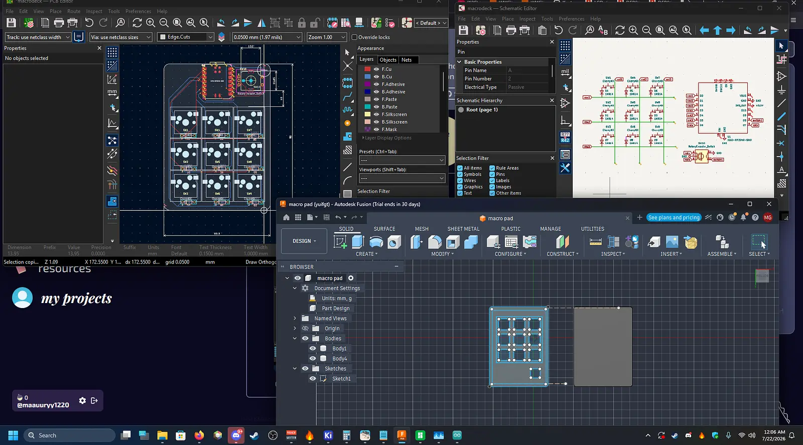

# Streamdeck copy kinda???

Hello this is my copy of a streamdeck that can do shortcuts, hotkeys, and maybe like a soundboard maybe later.

# Devlog #1 


My frist devlog is just the schematic of the pcb however maybe I might cange a few things but right now its fine. mybey colume control may benfit me in some way however im not sure

# Devlog #2


i managed to do many things today. for starters I was able to model the pcb of the actual schematic and I did eventually add a rotary encoder for volume control however this was a pain in the butt because to figure out how the rotary encoder should connect to the seed studio. anyways, I did also make the 3d model of the cade that the board would fit into and at the time of writing this its cirrently printing on my 3d printer.

# Devlog #3

no image today but the case came out looking great but i think i mesured the pcb wrong because it looked a little small for hot sawp switches to fit but I dont know. Also I managed to get the code in a beta but I have no idea how to code and I am still looking at learning about that so I asked the github guy for help 

# if you wanna copy here is a Setup Guide

## Setup

1. Copy `main.py` onto your RP2040 board running CircuitPython.
2. Adjust `KEY_PINS`, encoder pins, and `KEY_ACTIVE_HIGH` in `main.py` to match your wiring.
3. Install PySerial and Keyboard on your PC:

```bash
python -m pip install pyserial
```

```bash
python -m pip install keyboard
```

4. Run the host UI:

```bash
python host_ui.py
```

## Host UI commands

- `s`: request current state
- `r`: reset encoder position
- `d`: toggle debug reporting
- `h`: show help
- `q`: quit
